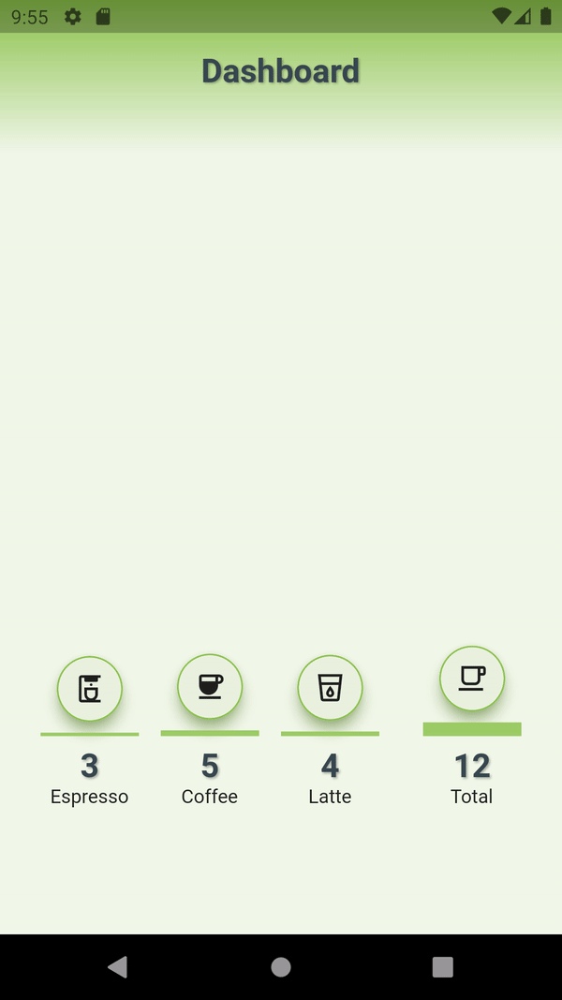

# dashboard_changenotifier
Dashboard using `ChangeNotifier` and `AnimatedBuilder`.
State Management by using built-in Flutter classes.

## Video Tutorial
[YouTube Video](https://youtu.be/Gr2Ly-XiLNU)

[Blog](https://jedipixels.dev/flutter-state-management-using-changenotifier-animatedbuilder)

[GitHub](https://github.com/JediPixels/dashboard_changenotifier)



## What is covered
In this project, you are going to take a look at:
- How to use `ChangeNotifier` and `AnimatedBuilder` to selectively rebuild individual widgets for performance
- State Management with build-in classes, no packages

## The Problem:
- Dashboard app needs to chart espresso, coffee, latte and total consumption
- Drawing each section bar, the chart needs to refresh independently for performance

## The Solution:
- Use the `ChangeNotifier` and `AnimatedBuilder` to allow to selectively rebuild individual widgets for performance


## ChangeNotifier and AnimatedBuilder
The `ChangeNotifier` and `AnimatedBuilder` allow to selectively rebuild individual widgets for performance

1. Create a class that extends `ChangeNotifier`
2. Add fields to contain data
3. Add methods to modify data and call the `notifyListeners()` method
4. Add the `AnimatedBuilder` widget in the widget tree to rebuild widgets selectively if the data changed

```
class Section {
  int espresso = 0;
  int coffee = 0;
  int latte = 0;

  Section(
      {required this.espresso,
      required this.coffee,
      required this.latte});
}

class TotalCoffeeChangeNotifier extends ChangeNotifier {
  int totalCoffee = 0;

  void totalNumberOfCoffee({required int espresso, required int coffee, required int latte}) {
    totalCoffee = espresso + coffee + latte;
    notifyListeners();
  }
}

class CoffeeChangeNotifier extends ChangeNotifier {
  late Section section;

  void addNumberOfCoffee({required int espresso, required int coffee, required int latte}) {
    section.espresso += espresso;
    section.coffee += coffee;
    section.latte += latte;
    notifyListeners();
  }
}

// Child Widget
AnimatedBuilder(
  animation: totalCoffeeChangeNotifier,
  builder: (BuildContext context, Widget? snapshot) {
    debugPrint('Total: ${totalCoffeeChangeNotifier.totalCoffee}');
    return MoodVerticalBarWidget(
      icon: Icons.local_cafe_outlined,
      numberToPlot: totalCoffeeChangeNotifier.totalCoffee,
      numberToPlotMax: numberToPlotMax,
      title: 'Total',
    );
  }
),
```

## How it Works
`ChangeNotifier` and `ValueListenableBuilder` - The `ChangeNotifier` and `AnimatedBuilder` allow to selectively rebuild individual widgets for performance. Use fields to contain data defining them in the `ChangeNotifier`. Use methods to modify data and call the `notifyListeners()` method. Use the `AnimatedBuilder` widget in the widget tree to rebuild widgets selectively if the data changed.
